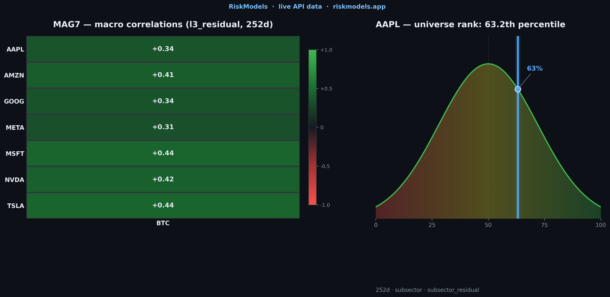
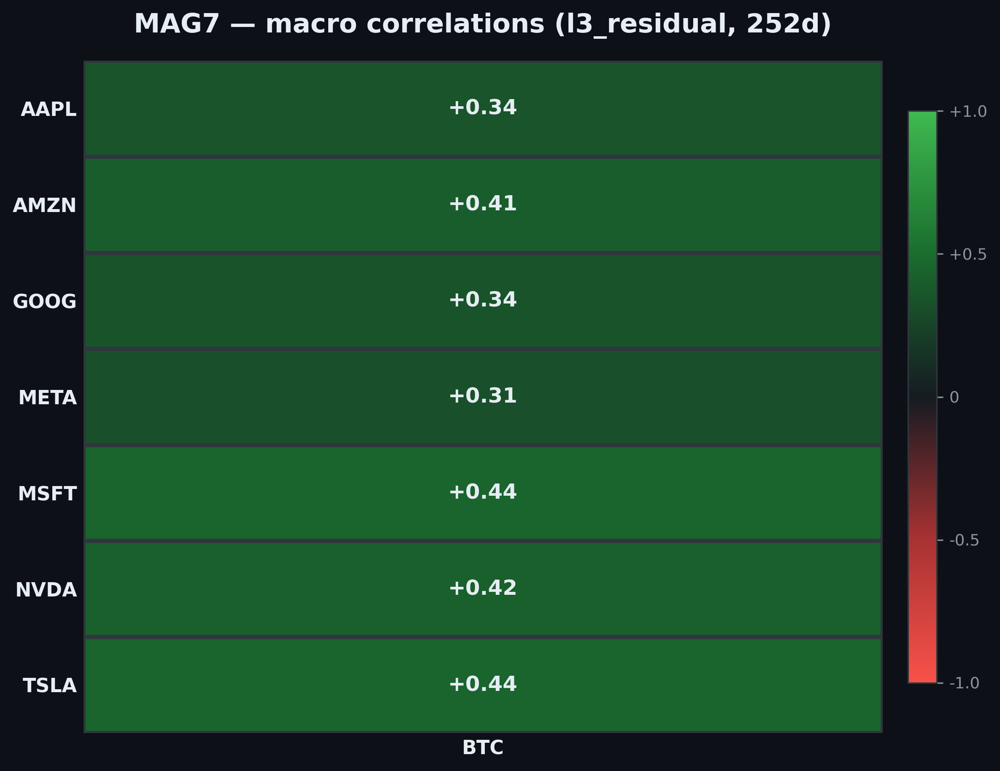
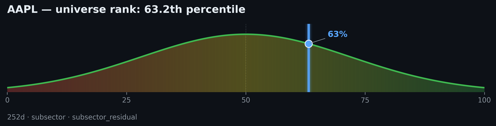
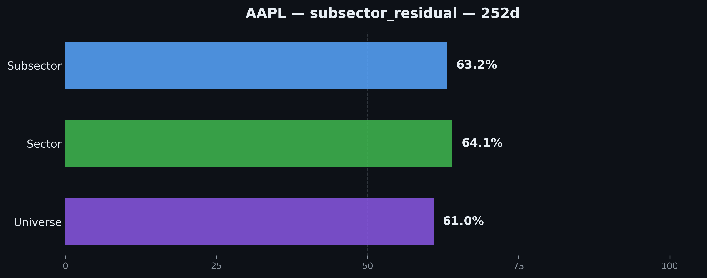

RiskModels provides factor decompositions and ETF-executable hedge ratios for US equities. The dataset is **simulation-grade**: it covers on the order of **16,000 US stocks** across the full historical panel, while **at each month end** the model’s headline universe is the **largest ~3,000 by market cap**—the set the API surfaces for everyday risk and hedging.

**Post-regression outputs** (hedge ratios, explained-risk decompositions, and related L1–L3 series) are on **daily history from 2007 through present**; **split- and dividend-adjusted returns** (the inputs to the rolling regressions) begin **2006-01-04**. The API is AI-agent ready, including a built-in Model Context Protocol (MCP) server for seamless integration with LLMs.

# RiskModels API Developer Portal

[](https://github.com/Cerebellum-Archive/RiskModels_API/actions/workflows/ci.yml)
[](https://riskmodels.net/docs/api/erm3)
[](OPENAPI_SPEC.yaml)
[](https://pypi.org/project/riskmodels-py/)



This repository is the **authoritative public API reference** for the [RiskModels](https://riskmodels.net) equity risk model API, featuring:

- 📚 **Comprehensive API Documentation** — OpenAPI 3.0.3 specification, guides, and examples
- 🌐 **Developer Portal** — Beautiful Next.js site (this repo) deployed at **riskmodels.app**
- 🐍 **Python & TypeScript Examples** — Production-ready code in `examples/`
- 🤖 **AI Agent Integration** — MCP server, OAuth2, and agent manifest

---

## 🚀 Quick Links

- **Developer Portal:** [riskmodels.app](https://riskmodels.app)
- **Live API Docs:** [riskmodels.net/docs/api/erm3](https://riskmodels.net/docs/api/erm3)
- **Get API Key:** [riskmodels.app/get-key](https://riskmodels.app/get-key)
- **API Terms:** [riskmodels.net/terms/api](https://riskmodels.net/terms/api)
- **Issues:** [github.com/Cerebellum-Archive/RiskModels_API/issues](https://github.com/Cerebellum-Archive/RiskModels_API/issues)
- **PyPI (Python SDK):** [riskmodels-py](https://pypi.org/project/riskmodels-py/)

### Canonical URLs (REST, OpenAPI, and docs)

Use these **only** for integrations and tooling:

| What | URL |
|------|-----|
| **REST base** (OpenAPI `servers`) | `https://riskmodels.app/api` |
| **Deployed OpenAPI JSON** (same spec as [`OPENAPI_SPEC.yaml`](./OPENAPI_SPEC.yaml)) | `https://riskmodels.app/openapi.json` |
| **Interactive API reference** (this portal) | [`/api-reference`](https://riskmodels.app/api-reference) |

**Important:** The hostname **`api.riskmodels.app`** is not used for the public API or machine-readable docs. Older links or docs that mention it should be treated as obsolete; use **`riskmodels.app`** (apex) as above.

---

## 📖 API Overview

The RiskModels API provides institutional-grade equity risk analysis:

- **Daily factor decompositions** — market, sector, subsector explained-risk fractions for the headline **~3,000** largest US stocks by market cap (month-end universe)
- **Hedge ratios** — dollar-denominated ETF hedge amounts (L1/L2/L3) designed to remain executable with liquid raw ETFs
- **Historical time series** — split- and dividend-adjusted returns (2006–present) plus rolling hedge ratios and ER (**2007–present**; factor outputs need a full regression window)
- **AI-agent ready** — OAuth2, per-request billing, machine-readable manifests

**Data coverage:** **~16,000** US stocks in the historical panel; **~3,000** largest by market cap at each **month end** for headline outputs. Updated daily. **Factor outputs (HR/ER):** **2007** through present. **Adjusted return series:** **2006-01-04** through present.

---

## Why The Engine Matters

RiskModels is designed to be useful for real portfolio work, not just descriptive analytics:

- **Built to be time-safe** — the engine is designed to avoid common sources of forward contamination such as recycled tickers, snapshot shares, and retroactive universe contraction
- **Grounded in a real Security Master** — ticker-level outputs sit on top of a point-in-time identity layer built for identifier continuity, symbol changes, and historically defensible shares data
- **Hierarchical by design** — the model separates market, sector, and subsector structure rather than collapsing everything into a flat beta view
- **Tradeable in practice** — the published hedge ratios are designed to work with liquid ETFs at execution time, not only with synthetic or orthogonalized factors
- **Built on adjusted return series** — split- and dividend-adjusted returns make the decomposition and hedge ratios more economically consistent over long horizons

For a deeper explanation of the engine design choices behind these claims, see the methodology docs and API reference.

---

## 🐍 Python SDK (riskmodels-py)

Prefer the Python SDK over raw REST for agent-native workflows — ticker resolution, semantic field normalization, validation with instructional errors, and LLM-ready context formatting are built in.

**Install** ([PyPI](https://pypi.org/project/riskmodels-py/)):

[](https://pypi.org/project/riskmodels-py/)

```bash
pip install riskmodels-py
# Optional — xarray cube from batch Parquet/CSV:
# pip install riskmodels-py[xarray]
```

**Quickstart:**

```python
from riskmodels import RiskModelsClient, to_llm_context

client = RiskModelsClient.from_env()
pa = client.analyze({"NVDA": 0.4, "AAPL": 0.6})
print(to_llm_context(pa))
```

**Documentation:**

- [Package README](./sdk/README.md) — install, methods, agent-native helpers
- [Quickstart](/quickstart) — 60-second setup path
- [API Docs](/docs/api) — agent-native helpers reference table

---

## Risk intelligence

Charts below are **generated from live API data** (MAG7 batch correlation + `get_rankings`) via [`scripts/generate_readme_assets.py`](./scripts/generate_readme_assets.py). Set `RISKMODELS_API_KEY` (free tier is sufficient), run the script from the repo root, then commit `./assets/` and `./public/docs/readme/`.

### Macro sensitivity

<p align="center">
  
  <br>
  <sub>Pearson correlations of L3 residual returns vs macro factors — <code>POST /correlation</code></sub>
</p>

### Cross-sectional rankings

<p align="center">
  
  <br>
  <sub>Universe rank percentile from <code>get_rankings</code></sub>
</p>

<p align="center">
  
  <br>
  <sub>Universe / sector / subsector rank percentile breakdown</sub>
</p>

---

## 🤖 MCP Server (v3.0.0-agent)

RiskModels includes a first-class [MCP (Model Context Protocol)](https://modelcontextprotocol.io) server, enabling AI agents to directly query risk data and perform factor analysis.

**MCP Connection (hosted API):**
- **SSE Endpoint:** `https://riskmodels.app/api/mcp/sse`
- **Authentication:** Bearer token (API key or OAuth2 JWT)
- **Discovery:** `https://riskmodels.app/.well-known/mcp.json` (see [OPENAPI_SPEC.yaml](./OPENAPI_SPEC.yaml))

**Local MCP server (`mcp/` in this repo)** — stdio transport for Cursor / Claude Desktop / Zed: discovers capabilities, schemas, and OpenAPI; it does **not** execute portfolio or decomposition RPCs. **Tools shipped here:**

- `riskmodels_list_endpoints` — List API capabilities (id, method, endpoint, short description)
- `riskmodels_get_capability` — Full capability record by id (parameters, pricing, examples)
- `riskmodels_get_schema` — JSON Schema for a response type (e.g. `ticker-returns-v2.json`)

For live risk data and portfolio math, call the **REST API** (e.g. `GET /api/metrics/{ticker}`, `POST /api/batch/analyze`, `GET /api/l3-decomposition`), the **Python SDK** (`riskmodels-py`), or use whatever tools your hosted MCP session returns from **`tools/list`** (do not assume tool names that are not listed there).

See [mcp/README.md](./mcp/README.md) for install and config.

---

## ⌨️ Command-line CLI (`riskmodels-cli`)

The npm package in [`cli/`](./cli/) installs the `riskmodels` binary: config, SQL query (billed API or direct Supabase), schema introspection, balance, and static agent manifests.

**Install from npm (after you publish `cli/`):**

```bash
npm install -g riskmodels-cli
riskmodels --help
```

**Develop from this repo:**

```bash
cd cli
npm ci
npm run build
npm run install:global   # optional: npm link for local testing
```

**Publish** (maintainers only): run `npm publish` from the `cli/` directory, not the repo root. The root app is `private` and is not published to npm.

---

## 💻 Developer Portal (This Repo)

This repo now includes a **Next.js developer portal** with:

- ✨ Hero landing page with feature highlights
- 📚 MDX-powered documentation (README_API.md, AUTHENTICATION_GUIDE.md)
- 🔍 Interactive API reference (Redoc OpenAPI viewer)
- 💡 Code examples with syntax highlighting and copy buttons
- 🎯 Step-by-step quickstart guide

### Local Development

```bash
# Install dependencies
npm install

# Option A: Copy env template and fill in Supabase/Stripe keys manually
cp .env.example .env.local

# Option B: Use Doppler (recommended for team consistency)
# Ensure `doppler login` is done, then:
doppler secrets download --no-file --format env > .env.local

# Generate OpenAPI JSON for Redoc
npm run build:openapi

# Run dev server
npm run dev
```

**Screenshot Capture Hygiene:**

When capturing site screenshots for audit or documentation:
1. **Ensure the build passes first:** `npm run build` must complete without errors
2. **Verify the dev server serves HTTP 200:** Visit `http://localhost:3000` and confirm pages render (not "Internal Server Error")
3. **Run the capture script:** `python3 capture_site.py` (requires Playwright)

The script will skip pages returning HTTP 500 or containing "Internal Server Error" content. Screenshots with server errors should never be committed to the repository.

**Environment Management with Doppler:**

This repo uses [Doppler](https://doppler.com) for secrets management. The `doppler.yaml` is pre-configured for the `erm3` project:

```bash
# Verify setup (should show project: erm3, config: dev)
doppler setup

# List all secrets
doppler secrets

# Get a specific secret
doppler secrets get STRIPE_SECRET_KEY

# Export dev secrets to .env.local for curl testing and local dev
npm run doppler:env

# Push production secrets to Vercel (requires vercel login + project link)
npm run vercel:sync-env:doppler
```

**For curl/API testing with Doppler secrets:**

```bash
# 1. Export secrets to .env.local
npm run doppler:env

# 2. Source them for your shell session
source .env.local

# 3. Use in curl commands
curl -H "Authorization: Bearer $RISKMODELS_API_SERVICE_KEY" \
  https://riskmodels.app/api/health
```

See [DEPLOYMENT.md](DEPLOYMENT.md) for detailed Vercel/Doppler integration.

Visit [http://localhost:3000](http://localhost:3000)

### Build & Deploy

```bash
# Build for production
npm run build

# Start production server
npm start
```

**Deployment:** See [DEPLOYMENT.md](DEPLOYMENT.md) for Vercel setup, env vars, and Supabase/Stripe config.

---

## 📂 Repository Structure

```
RiskModels_API/
├── app/                      # Next.js app
│   ├── api/                  # API routes (REST)
│   ├── page.tsx              # Hero landing page
│   ├── layout.tsx            # Root layout with Navbar/Footer
│   ├── docs/[[...slug]]/     # MDX docs renderer
│   ├── api-reference/        # Redoc OpenAPI viewer
│   ├── examples/             # Code examples showcase
│   └── quickstart/           # Quickstart guide
├── components/               # React components (new)
│   ├── Navbar.tsx
│   ├── Footer.tsx
│   ├── Hero.tsx
│   ├── CodeBlock.tsx
│   └── Logo.tsx
├── content/docs/             # MDX content (new)
│   ├── api.mdx
│   └── authentication.mdx
├── cli/                      # Command-line CLI (`riskmodels-cli`)
├── sdk/                      # Python SDK (`riskmodels-py`) source
├── examples/                 # Runnable examples
│   ├── python/
│   └── typescript/
├── mcp/                      # MCP (Model Context Protocol) server
├── public/                   # Static assets (new)
│   ├── transparent_logo.svg
│   └── openapi.json          # Generated from OPENAPI_SPEC.yaml
├── styles/                   # Global styles (new)
├── lib/                      # Utilities (new)
├── OPENAPI_SPEC.yaml         # Canonical OpenAPI spec
├── README_API.md             # API reference (source for content/docs/api.mdx)
├── AUTHENTICATION_GUIDE.md   # Auth guide (source for content/docs/authentication.mdx)
├── SEMANTIC_ALIASES.md       # Field definitions
└── package.json              # Next.js deps (new)
```

---

## 🛠️ Tech Stack (Developer Portal)

- **Framework:** Next.js 15 (App Router)
- **Styling:** Tailwind CSS 3.4, dark mode default
- **MDX:** @next/mdx for documentation
- **API Reference:** Redoc (OpenAPI 3.0 viewer)
- **Code Highlighting:** Custom CodeBlock with copy button
- **Fonts:** Inter (system-ui fallback)
- **Colors:** Blue primary (`hsl(217, 91%, 60%)`), zinc/slate dark palette

---

## 📄 Documentation Files

| Document | Description |
|---|---|
| [README_API.md](README_API.md) | Complete API overview, endpoints, key concepts |
| [API_TERMS.md](API_TERMS.md) | API Terms of Service ([riskmodels.net/terms/api](https://riskmodels.net/terms/api)) |
| [PLAID_HOLDINGS_UX.md](PLAID_HOLDINGS_UX.md) | Plaid connection flow and holdings API user experience |
| [AUTHENTICATION_GUIDE.md](AUTHENTICATION_GUIDE.md) | Bearer token, OAuth2, Supabase JWT, rate limits |
| [DOCS_PROCESS.md](DOCS_PROCESS.md) | Process for adding new documentation |
| [SEMANTIC_ALIASES.md](SEMANTIC_ALIASES.md) | Field definitions, units, formulas |
| [RESPONSE_METADATA.md](RESPONSE_METADATA.md) | `_agent` block, response headers, pricing |
| [ERROR_SCHEMA.md](ERROR_SCHEMA.md) | Error codes and recovery patterns |
| [OPENAPI_SPEC.yaml](OPENAPI_SPEC.yaml) | OpenAPI 3.0.3 specification (v3.0.0-agent) |

---

## 🔗 Related

- **[ERM3](https://github.com/conradgann/ERM3)** — Python risk model computation engine (open source)

---

## 🤝 Contributing

We welcome pull requests, especially to improve the **OpenAPI spec** — clearer descriptions, better schemas, and more examples help everyone.

1. **OpenAPI spec:** [CONTRIBUTING.md](CONTRIBUTING.md) — PRs to `OPENAPI_SPEC.yaml` are encouraged
2. **Issues:** [Open an issue](https://github.com/Cerebellum-Archive/RiskModels_API/issues) for bugs or feature requests
3. **Examples:** Submit new examples via PR to `examples/`
4. **Docs:** Improve documentation by editing MDX files in `content/docs/`

---

## 📧 Support

- **API Support:** [contact@riskmodels.net](mailto:contact@riskmodels.net)
- **Issues:** [github.com/Cerebellum-Archive/RiskModels_API/issues](https://github.com/Cerebellum-Archive/RiskModels_API/issues)
- **Status:** [riskmodels.net/status](https://riskmodels.net/status)

---

## 📜 License

See [LICENSE](LICENSE) for details.

**© 2026 Blue Water Macro Corp. All rights reserved.**
